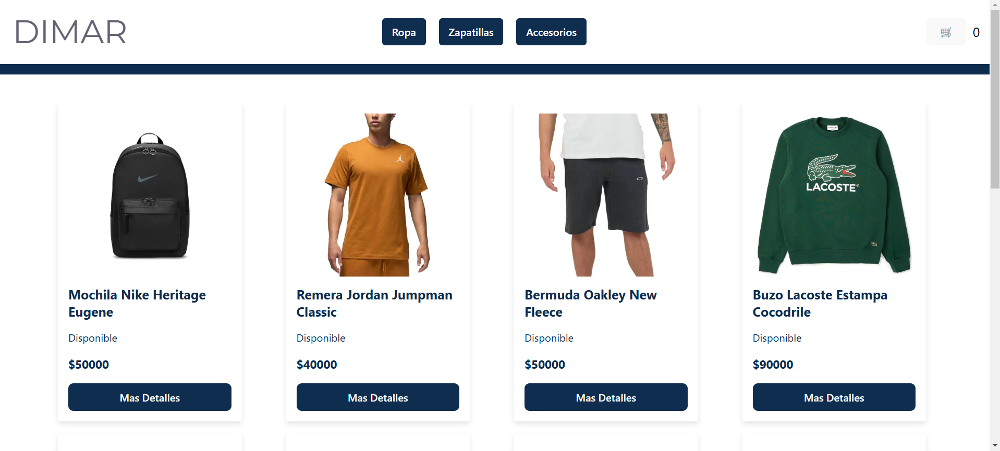

# ESTE ES MI PROYECTO CON REACT

## DIMAR es un e-commerce diseñado para ofrecer variedad de indumentaria masculina y unisex. El objetivo es brindar a los usuarios una experiencia de compra cómoda y moderna.

## Tecnologías utilizadas:

- React Router Dom: Es la base del proyecto.
- Vite: Para configurar y construir el proyecto.
- Firebase: Como base de datos para manejar los productos y generar órdenes.

## Caracteristicas del e-commerce:

- Catálogo de productos
- Sistema de categorías 
- Detalle de productos
- Carrito de compras
- Gneración de ordenes

## Visita la web:

[TechnoWorld]()

### ScreenShots de la web:

 